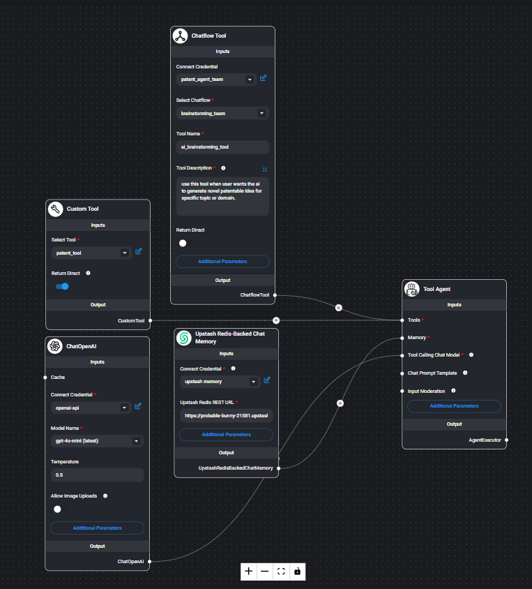
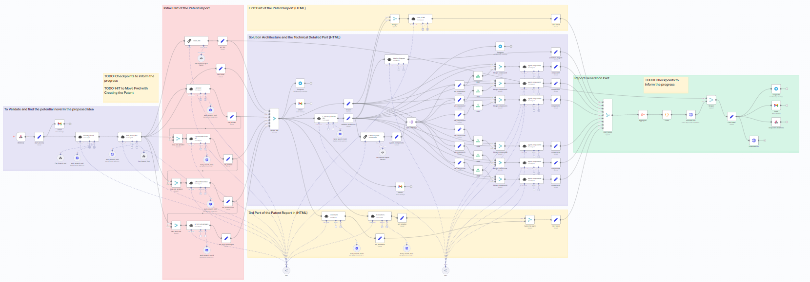

# IdeaSketch

IdeaSketch is a modern web application built with Next.js that provides an AI-powered chat interface to assist with developing patent ideas. The application features a responsive design, real-time message streaming, markdown rendering, and persistent chat history.


## Architecture Overview

IdeaSketch utilizes a sophisticated multi-service architecture for AI-powered patent idea generation:




### Workflow Process

1. **Frontend Interface**: The Next.js application provides the user interface and handles communication with the AI backend.

2. **AI Agent (Flowise)**: The main AI agent is implemented as a Flowise flow, which:
   - Processes the initial user request
   - Orchestrates the patent creation workflow
   - Manages the conversation context and generation

3. **Patent Generation (n8n)**: The Flowise flow triggers an n8n workflow that:
   - Performs specialized patent-specific processing
   - Generates structured patent ideas and content
   - Returns processed results to the Flowise agent

4. **Response Stream**: The AI-generated responses are streamed back to the frontend in real-time, creating a seamless user experience.

This architecture allows for complex AI processing while maintaining a responsive user interface.

## Features

- **Responsive UI**: Works seamlessly on desktop and mobile devices
- **Real-time Message Streaming**: See AI responses as they're generated
- **Markdown Support**: Rich text formatting with code syntax highlighting
- **Persistent Chat History**: Saves your conversations locally
- **Dark Mode Support**: Automatically adapts to your system preferences
- **Multiple Chat Sessions**: Create and manage multiple conversations

## Tech Stack

- **Framework**: [Next.js 15](https://nextjs.org/)
- **UI**: [React 19](https://react.dev/)
- **Styling**: [Tailwind CSS 4](https://tailwindcss.com/)
- **Icons**: [React Feather](https://github.com/feathericons/react-feather)
- **Markdown**: [React Markdown](https://github.com/remarkjs/react-markdown)
- **Syntax Highlighting**: [React Syntax Highlighter](https://github.com/react-syntax-highlighter/react-syntax-highlighter)
- **Table Support**: [Remark GFM](https://github.com/remarkjs/remark-gfm)
- **Build Tool**: [Turbopack](https://turbo.build/pack)

## Getting Started

### Prerequisites

- Node.js 18.x or later
- npm, yarn, pnpm, or bun

### Installation

1. Clone the repository:
   ```bash
   git clone https://github.com/yourusername/ideasketch.git
   cd ideasketch
   ```

2. Install dependencies:
   ```bash
   npm install
   # or
   yarn
   # or
   pnpm install
   # or
   bun install
   ```

3. Set up environment variables:
   
   Create a `.env.local` file in the root directory with the following variables:
   ```
   API_KEY=your-api-key-here
   GEMINI_API_KEY=your-gemini-api-key-here
   ```

4. Start the development server:
   ```bash
   npm run dev
   # or
   yarn dev
   # or
   pnpm dev
   # or
   bun dev
   ```

5. Open [http://localhost:3000](http://localhost:3000) with your browser to see the result.

## Project Structure

```
ideasketch/
├── public/               # Static assets
├── src/
│   ├── app/              # App router pages and layouts
│   │   ├── api/          # API routes
│   │   │   └── chat/     # Chat-related API endpoints
│   │   ├── chat/         # Chat interface pages
│   │   └── ...
│   ├── components/       # Reusable React components
│   ├── contexts/         # React context providers
│   ├── hooks/            # Custom React hooks
│   └── ...
├── .env                  # Environment variables (create this)
├── next.config.ts        # Next.js configuration
├── package.json          # Project dependencies
├── tailwind.config.ts    # Tailwind CSS configuration
├── flowise_flow.png      # Diagram of the Flowise automation flow
├── n8n_flow.png          # Diagram of the n8n workflow for patent generation
└── ...
```

## Key Components

- **ChatContext**: Manages chat state, history, and persistence
- **ChatInput**: Handles user input and message submission
- **MessageList**: Displays chat messages with Markdown rendering
- **Sidebar**: Navigation for chat history and new chat creation
- **API Routes**: Server-side endpoints for AI integration

## API Integration

IdeaSketch connects to external automation workflows for AI processing:

1. **Flowise Integration**: The frontend makes API calls to a Flowise flow endpoint via `/api/chat/generate-stream`, which enables streaming responses.
   
   ```javascript
   // From src/app/api/chat/generate-stream/route.ts
   const BASE_URL = 'https://flowise-13k6.onrender.com/api/v1/prediction/8ada17bf-c96e-43be-9b16-ec6d2dd1f7f4';
   ```

2. **n8n Integration**: The Flowise flow triggers an n8n workflow responsible for specialized patent generation logic.

3. **Query API**: A secondary API endpoint at `/api/chat/query` handles data retrieval and user-specific operations.

The system uses a streaming response pattern to deliver AI-generated content in real-time, enhancing the user experience by showing responses as they're being generated.

## Local Storage

The application uses browser local storage to persist:

- User ID
- Username
- Chat history
- Sidebar collapsed state

## Development Notes

### CSS Styling

The project uses Tailwind CSS with custom configuration. The base styling is in `src/app/globals.css`.

### State Management

React Context is used for global state management via `ChatContext` in `src/contexts/ChatContext.tsx`.

### Message Streaming

The application implements a custom streaming solution to display AI responses in real-time:

1. User sends a message
2. A placeholder assistant message is added to the chat
3. The API is called with streaming enabled
4. The assistant's message is updated in real-time as chunks arrive
5. Auto-scrolling keeps the latest content in view

## Production Build

To build the application for production:

```bash
npm run build
# or
yarn build
# or
pnpm build
# or
bun build
```

To start the production server:

```bash
npm run start
# or
yarn start
# or
pnpm start
# or
bun start
```

## Deployment

The easiest way to deploy your Next.js app is to use the [Vercel Platform](https://vercel.com/new?utm_medium=default-template&filter=next.js&utm_source=create-next-app&utm_campaign=create-next-app-readme) from the creators of Next.js.

Check out the [Next.js deployment documentation](https://nextjs.org/docs/app/building-your-application/deploying) for more details.

## Environment Variables

| Variable | Description | Required |
|----------|-------------|----------|
| `API_KEY` | Authentication key for the main API | Yes |
| `GEMINI_API_KEY` | Authentication key for Google's Gemini API | Optional |

## Contributing

Contributions are welcome! Please feel free to submit a Pull Request.

1. Fork the repository
2. Create your feature branch (`git checkout -b feature/amazing-feature`)
3. Commit your changes (`git commit -m 'Add some amazing feature'`)
4. Push to the branch (`git push origin feature/amazing-feature`)
5. Open a Pull Request

## License

This project is licensed under the MIT License - see the LICENSE file for details.

## Acknowledgments

- This project was bootstrapped with [`create-next-app`](https://nextjs.org/docs/app/api-reference/cli/create-next-app)
- Uses [Geist](https://vercel.com/font) font from Vercel

---

Created and maintained by [Your Name](https://github.com/yourusername)
